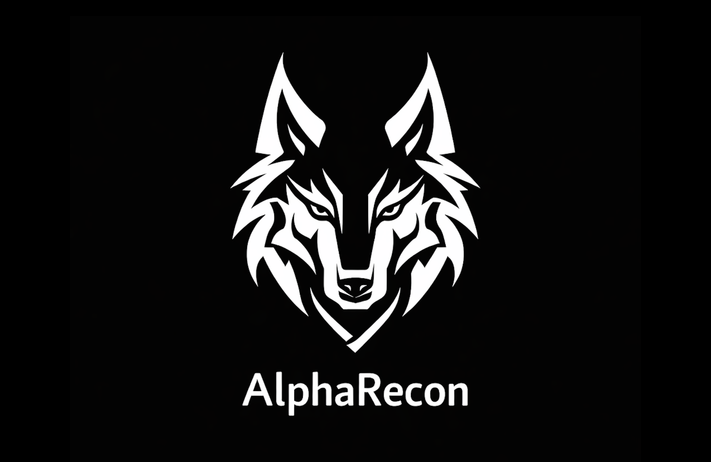
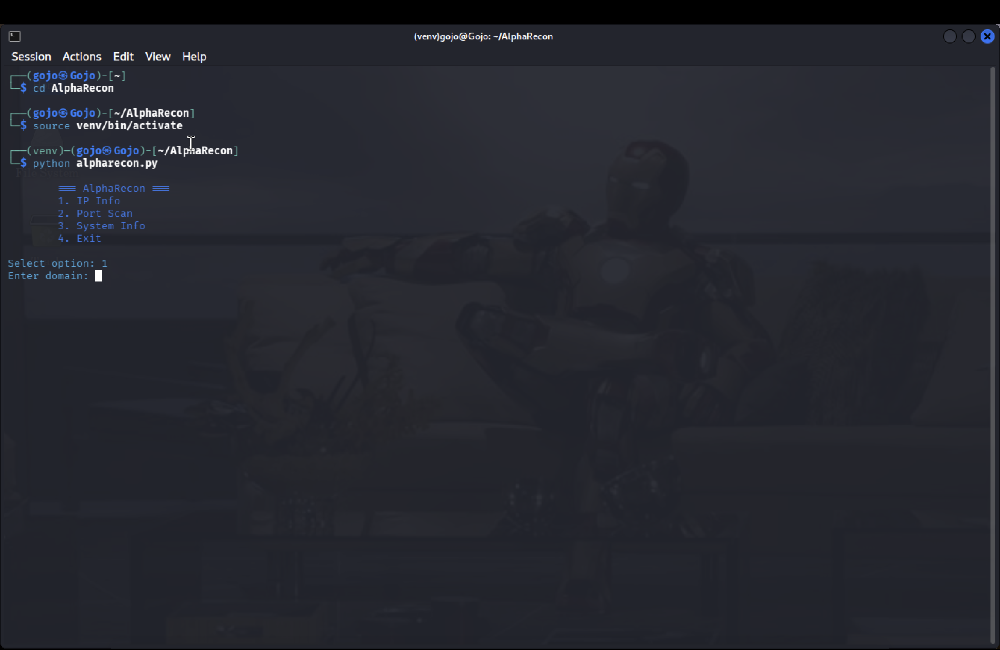

<p align="center">
  
</p>

<h1 align="center">AlphaRecon 🔥</h1>

<p align="center">
  Recon & Kali Automation Toolkit for Cybersecurity Students
</p>

---
---

## 📸 Preview



---

## 🚀 Features

- IP Information Lookup
- Basic Port Scanner
- System Information Tool
- CLI Interface

---

## 🐧 Installation (Kali Linux)

```bash
git clone https://github.com/ManojAlpha/AlphaRecon.git
cd AlphaRecon
python3 -m venv venv
source venv/bin/activate
pip install -r requirements.txt
python alpharecon.py
